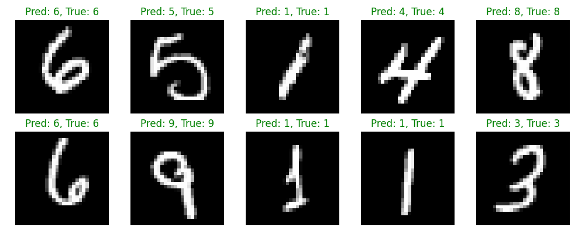

# Pytorch
Pytorch is an open source framework for creating ML models in Python. It can be used for a variety of purposes, such as computer vision (using ML to analyse images) or language processing.

In this case, I will be using it to build a Convolutional Neural Network - a popular form of deep learning model used to predict the content of a pre-processed image.

# Description
In theory, a CNN bears some similarities to Logistic Regression - training based on a large dataset to carry out predictions, with varying accuracy based on that dataset

If you haven't already, I would suggest going through that folder first, as it covers some of the underlying fundamental ideas. 

As before, I will be splitting this readme into sections to cover the main steps of training the model, as well as saving it to your system.

## Setup - MNIST_model.py

First, after importing all of our dependencies, we need to aquire a dataset. In this case, I will be using the MNIST dataset - a collection of handwritten numbers arranged with set spacing and sizes. This is important for building our model, as it requires a set size and zero overlap between any of the numbers.


```
batch_size = 60
train_dataset = datasets.MNIST(root="dataset/", download=True, train=True, transform=transforms.ToTensor())
train_loader = DataLoader(dataset=train_dataset, batch_size=batch_size, shuffle=True)
test_dataset = datasets.MNIST(root="dataset/", download=True, train=False, transform=transforms.ToTensor())
test_loader = DataLoader(dataset=test_dataset, batch_size=batch_size, shuffle=True)
```
Much like with Logistic Regression, we've also split our dataset - we have two training components, as well as two testing components for once our model has been set up.

Within the file is a small excerpt to display a sample of the dataset, with the calling line commented out to prevent it actually running each time the script is run. Below is the actual sample


Next, we need to define our model as a class. Thankfully, the nn library has a predefined CNN class, we just need to make some additional changes for this model, split into two parts - the first defining the distinct layers, then the second defining how they are applied in operations. 

That done, a quick note on training ML models - a major feature of Pytorch is that it is built with GPU integration in mind, allowing it to take advantage of hardware acceleration, particularly Nvidia GPUs with CUDA cores, though AMD GPUs can also be used. This requires additional steps to enable and implement, so I will not be covering it here. Either way, the selected device will be allocated for training
```
device = "cuda" if torch.cuda.is_available() else "cpu"

model = CNN(in_channels=1, num_classes=10).to(device)
```

Now, we can begin training the model. Here, we require multiple passes through the training data, in epochs. With my setup, each pass takes 10-15 seconds. You can have more or fewer passes, but 10 gave good results. 


The performance of this training will depend on your setup and configuration. In my case, the job was allocated to the cpu, which resulted in high usage, and took a little under 2 minutes to complete


Now that we have a model, we can test the accuracy. After inititalising the accuracy object, we load in the testing component of the initial dataset, and have the model carry out predictions. which it is able to do with a very high rate of accuracy.


## Exporting to MNIST_load.py

With our model set up, we can export it to be used in other files, using the following command - 
```
torch.save(model.state_dict(), 'MNISTmodel.pth')
```
Much like with pickle, we simply save the model into the local directory, allowing us to copy and move it elsewhere if needed. Then, we load it into our new file, after initialising the model object 
```
loaded_model = CNN(in_channels=1, num_classes=10)

loaded_model.load_state_dict(torch.load('MNISTmodel.pth'))
print(loaded_model)
```
This will give a similar output to the below, confirming that our model has been loaded in


Now that we've loaded our model, we can see how it actually performs practically. After defining a new function for displaying the output, we can import the dataset from before, and show the results of the model predicting the numbers, showing that it is successfully able to translate a handwritten character into a digital output.



# Final thoughts

This is a simple example of how to build a ML model in Pytorch, and deploy it in a small-scale application. What's more, compared to Logistic Regression, there is much more room to change the scope of the project. In this case, we trained it on written numbers, but theoretically you could train it on any subject, provided the input data meets the required format.